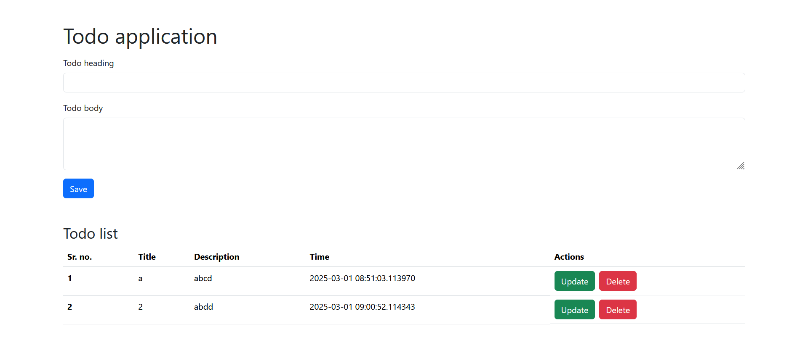

# TODO app -  with Flask, SQLite

This is a simple web application built using **Flask**, a micro web framework for Python, and **SQLite**, a lightweight database. The app demonstrates how to create a basic web app with CRUD (Create, Read, Update, Delete) operations using Flask and SQLite.

## Features 🌟

- User authentication (login and registration) 🔒
- CRUD functionality with SQLite database 💾
- Responsive web design 📱
- Simple UI for managing records 📝

## Requirements 📋

- Python 3.x 🐍
- Flask 🔥
- SQLite (integrated with Flask) 💻
- Jinja2 (templating engine) 🎨

## First look



## Installation 🛠️

Follow these steps to get the app running locally.

### 1. Clone the repository

```
git clone https://github.com/Prajwalkulkarni766/todo_list_flask.git
cd todo_list_flask
```

### 2. Create a virtual environment
```
python3 -m venv venv
```

#### 2.1 For mac or linux
```
source venv/bin/activate    
```

#### 2.2 For windows
```
venv/Scripts/activate      
```

### 3. Install dependencies
``` 
pip install -r requirements.txt
```

## Run the app 🚀
```
python app.py
```

## Acknowledgements 🙏
Flask documentation for providing the foundation for this app.
SQLite for being an easy-to-use database engine.